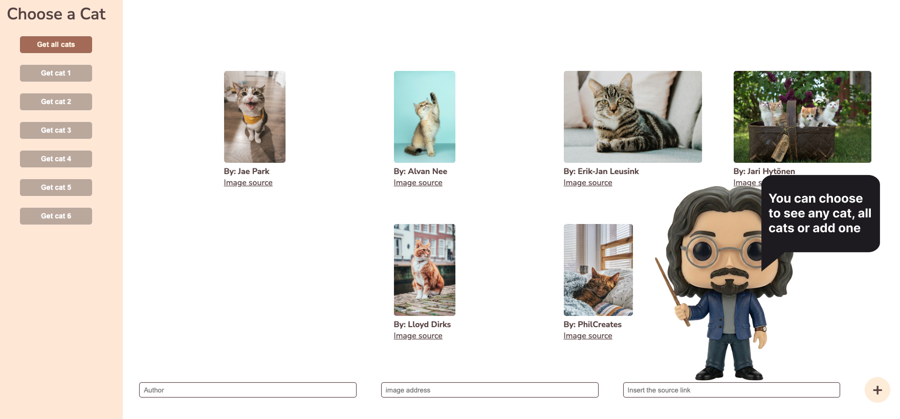

# Cat API & Web App

A full-stack web application built to explore the fundamentals of NestJS. This project served as a hands-on learning journey to understand NestJS syntax, project architecture, and how to bootstrap a backend from scratch, paired with a modern React frontend.

## The Project

The repository is structured into two main directories:
* **Backend:** Powered by **NestJS**, serving as the core API to manage our feline data.
* **Frontend:** Built with **React** and **TypeScript**, providing a clean and interactive user interface.

## Tech Stack
* **Backend:** NestJS, TypeScript
* **Frontend:** React, TypeScript

## Preview

